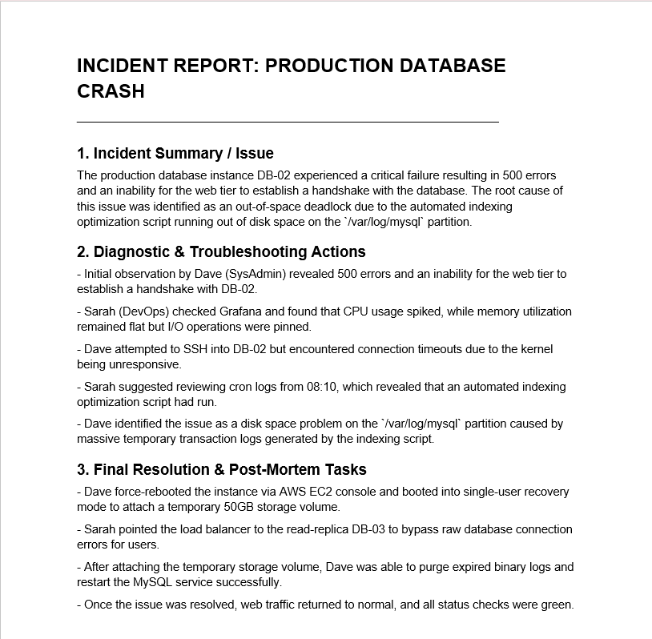

# Intelligent Document Automation

## Overview
This project simulates the core functionality of Microsoft 365 Copilot's document automation capabilities. It demonstrates how unstructured operational data (like Teams chat transcripts or server logs) can be programmatically summarized and formatted into official business documentation.

## The Prompting Framework
This architecture applies Microsoft's Enterprise Prompting Framework:
* **Goal:** Extract root cause and resolution steps.
* **Context:** Generate an official Tier 1 Incident Report.
* **Source:** Strictly utilize the `data/chat_transcript.txt` file.
* **Expectation:** Output structured text optimized for a `.docx` template.

## Repository Structure
* `/data` - Contains the raw, unstructured input data and the finalized, formatted `.docx` output.
* `/src` - The Python automation script utilizing `python-docx` and LLM prompting logic.

## Visual Architecture

